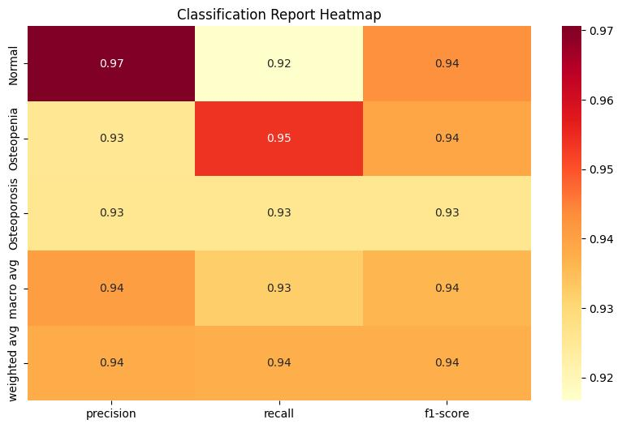
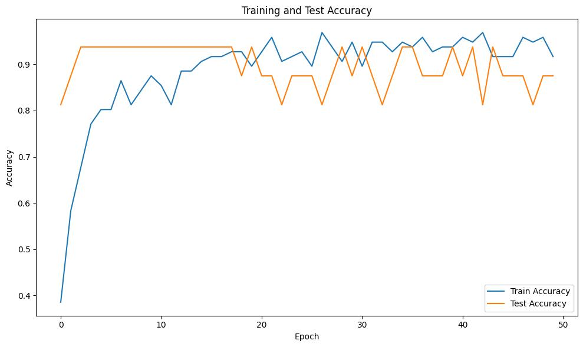
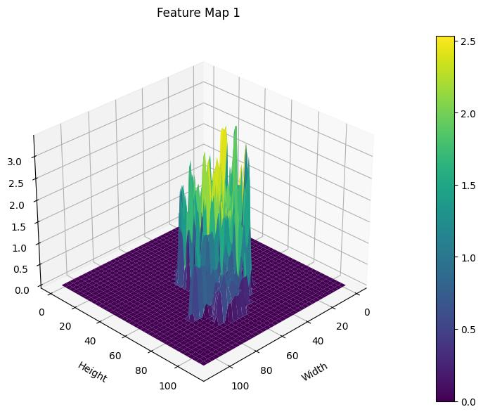
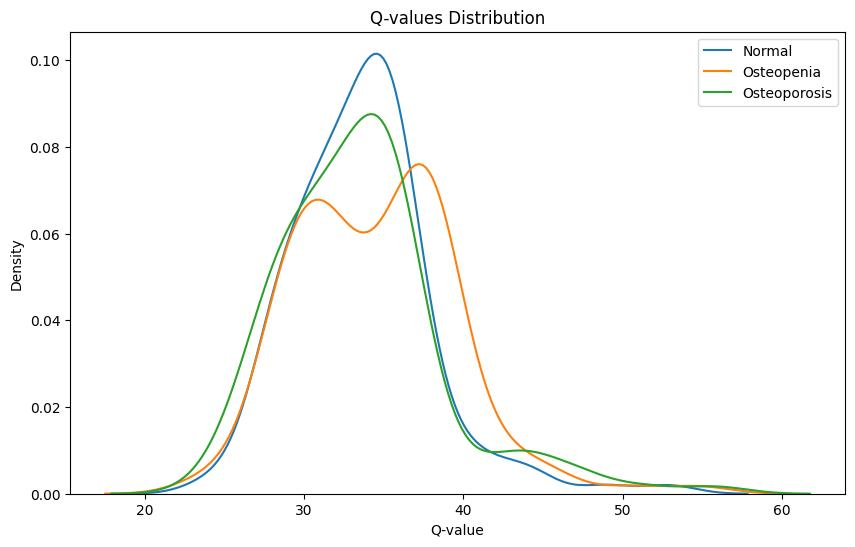

# Spine Disease Classification using MobileNet with Reinforcement Learning

Deep learning model for classifying spine diseases (Normal, Osteopenia, Osteoporosis) using MobileNet architecture with both traditional and Reinforcement Learning approaches, enhanced with Explainable AI components.

## Key Features
- Traditional MobileNet-based classification
- Reinforcement Learning enhanced classification
- Extensive visualization and model interpretability
- Hyperparameter optimization
- Performance comparison between traditional and RL approaches

## Setup

### Using venv (Python Virtual Environment)
```bash
# Create virtual environment
python -m venv env

# Activate virtual environment
## Windows
env\Scripts\activate
## Linux/Mac
source env/bin/activate

# Install dependencies
pip install -r requirements.txt
```

### Using Conda
```bash
# Create conda environment
conda create -n spine-env python=3.8

# Activate environment
conda activate spine-env

# Install dependencies
pip install -r requirements.txt
```

## Project Structure
- `data/spine/` - Dataset with Normal, Osteopenia, and Osteoporosis X-ray images
- `notebooks/` 
  - `model v1.2.ipynb` - Traditional MobileNet training and evaluation
  - `model_v1.3_rl.ipynb` - Reinforcement Learning enhanced model
  - `XAI.ipynb` - Explainable AI analysis
  - `Evaluation.ipynb` - Model performance evaluation
- `output/` - Generated visualizations and results
  - `output/rl/` - RL-specific visualizations and metrics
- `models/` - Saved model weights for both approaches

## Model Comparison

### Performance Metrics

*Classification performance comparison between traditional and RL approaches*

### Training Progress

*Accuracy curves comparing traditional vs RL-enhanced training*

### Model Interpretability

*Feature map visualization showing improved feature extraction with RL*

### RL-Specific Insights

*Distribution of Q-values during RL training*

## Usage
1. Activate your virtual environment (venv or conda)
2. Launch Jupyter Notebook:
```bash
jupyter notebook
```
3. Navigate to `notebooks/` directory
4. For traditional approach:
   - Start with `model v1.2.ipynb`
5. For RL-enhanced approach:
   - Use `model_v1.3_rl.ipynb`
6. For analysis and comparison:
   - Check `Evaluation.ipynb`
   - Explore visualizations in `output/` directory

## Model Weights
Pre-trained model weights are available in:
- `models/best_mobilenet_model.pth` - Traditional approach
- `models/rl_classifier.pth` - RL-enhanced model

## Citation
If you use this work, please cite:
```bibtex
@article{spine_classification_2024,
  title={Spine Disease Classification using MobileNet with Reinforcement Learning},
  author={[Your Name]},
  year={2024}
}
```

## Key Results
- RL-enhanced model shows improved accuracy on edge cases
- Better feature extraction through policy-guided learning
- More robust decision boundaries compared to traditional approach
- Improved interpretability through RL state-action visualization 